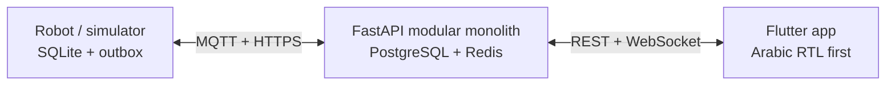
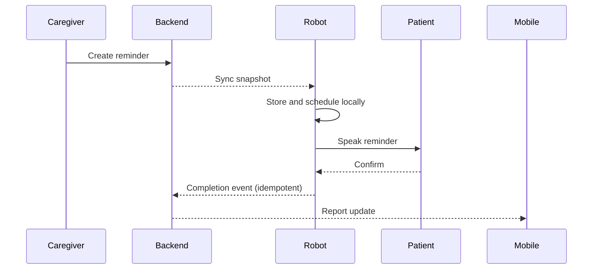
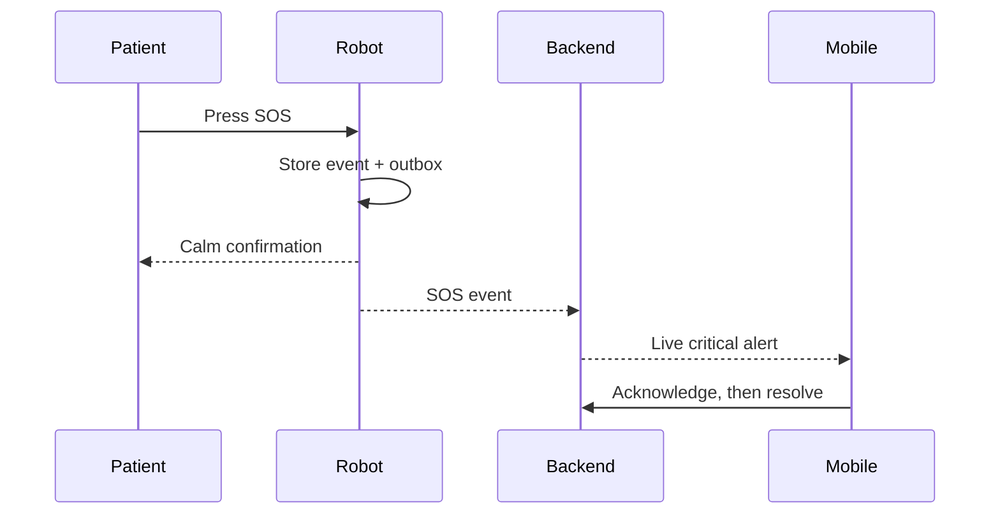
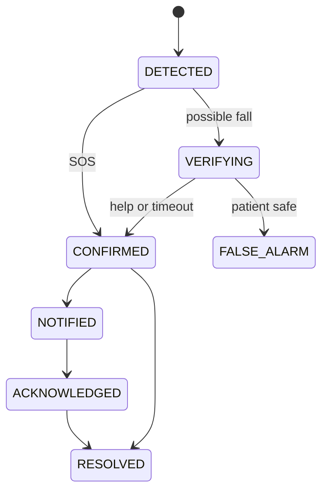
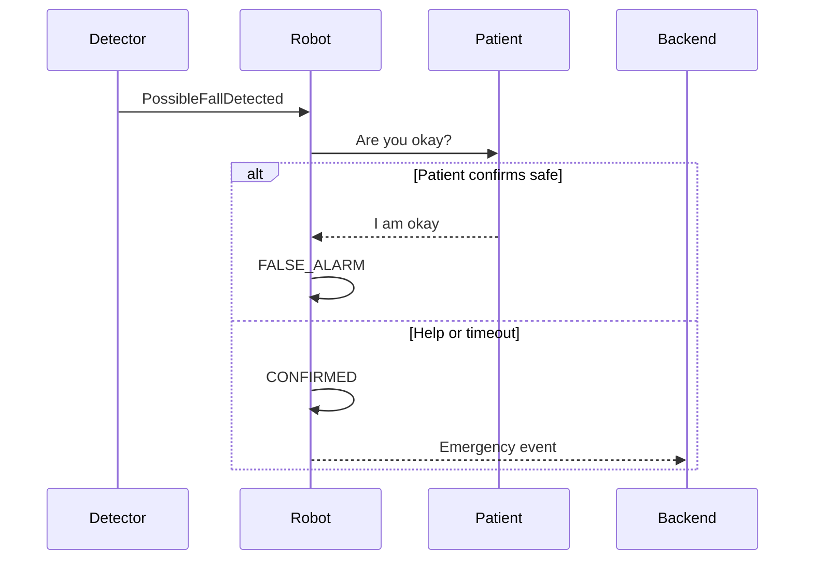
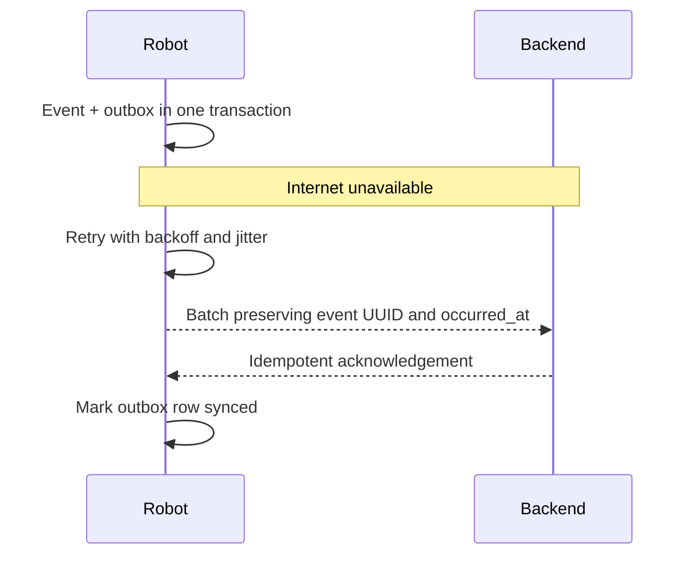

# Architecture

RAFEEQ is an edge-cloud modular monolith. The robot owns critical offline behavior; the backend owns shared configuration and APIs; the app never connects directly to hardware or databases.

